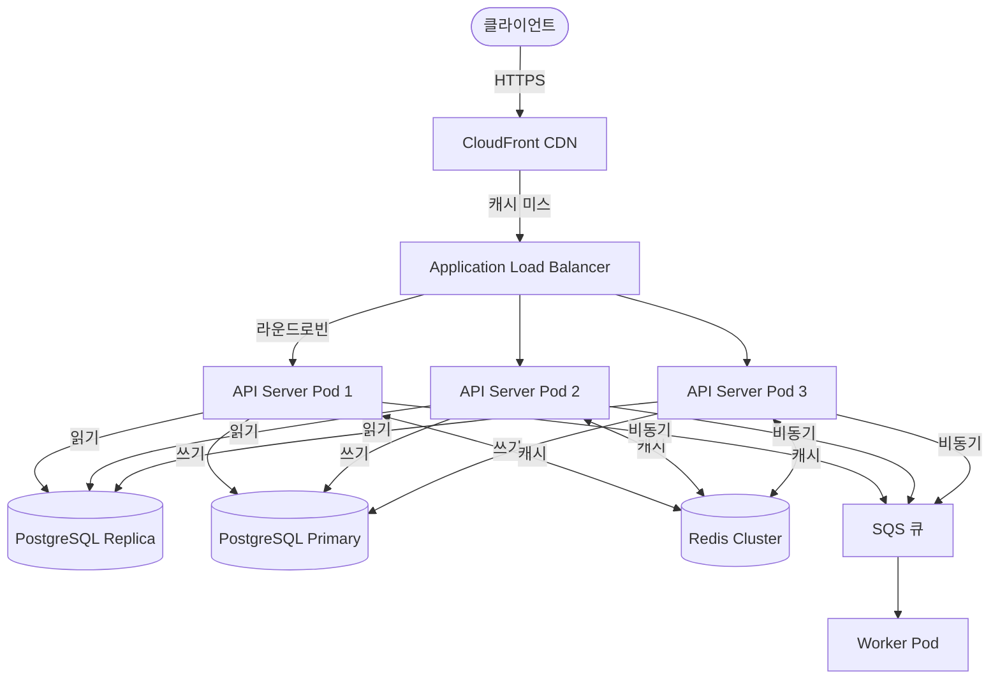

# 시스템 아키텍처 개요

## 전체 구성도

## 주요 컴포넌트 설명

| 컴포넌트 | 기술 | 역할 |
|---|---|---|
| API Server | FastAPI | REST API 처리 |
| PostgreSQL | RDS Multi-AZ | 주 데이터 저장소 |
| Redis | ElastiCache | 세션/캐시 |
| SQS | AWS SQS | 비동기 작업 큐 |
